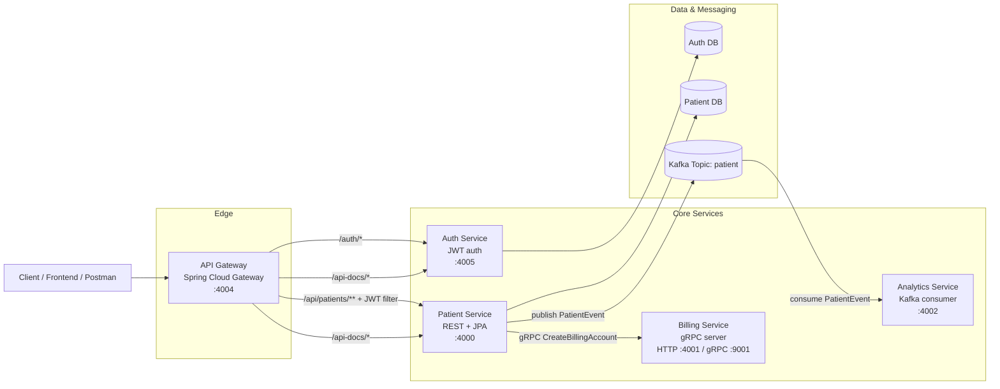

# PatientFlow

PatientFlow is a microservices-based patient management system built with Spring Boot. The repository is organized around a small healthcare workflow: authenticate a user, expose protected patient APIs through an API gateway, persist patient records, provision a billing account over gRPC, and publish patient-created events to Kafka for downstream analytics.

The implementation currently consists of five services plus a lightweight integration test module:

- `api-gateway`: entry point for external clients
- `auth-service`: login and JWT validation
- `patient-service`: CRUD operations for patients
- `billing-service`: gRPC endpoint for billing account creation
- `analytics-service`: Kafka consumer for patient events
- `integration-tests`: REST Assured based smoke/integration tests

## Architecture

### High-Level Design



### Service Responsibilities

| Service | Port(s) | Responsibility | Communication |
| --- | --- | --- | --- |
| `api-gateway` | `4004` | Single entry point for clients, route forwarding, JWT enforcement for patient APIs | HTTP to `auth-service` and `patient-service` |
| `auth-service` | `4005` | User login, token generation, token validation | REST, JPA |
| `patient-service` | `4000` | CRUD for patient records, validation, persistence | REST, JPA, gRPC client, Kafka producer |
| `billing-service` | `4001`, `9001` | Billing account creation stub exposed as gRPC service | gRPC server |
| `analytics-service` | `4002` | Consumes `patient` topic events and logs/handles analytics events | Kafka consumer |
| `integration-tests` | n/a | End-to-end verification via gateway endpoints | REST Assured |

## Main Flows

### 1. Login and JWT issuance

1. Client calls `POST /auth/login` through the gateway.
2. `api-gateway` forwards the request to `auth-service`.
3. `auth-service` verifies the credentials against the user store.
4. On success, `auth-service` returns a JWT token.

### 2. Protected patient API access

1. Client calls `GET /api/patients` or other patient endpoints through `api-gateway`.
2. Gateway filter `JwtValidationGatewayFilterFactory` reads the `Authorization` header.
3. Gateway calls `auth-service /validate`.
4. If the token is valid, the request is forwarded to `patient-service`.

### 3. Patient creation workflow

1. Client sends `POST /api/patients` through the gateway.
2. `patient-service` validates and saves the patient record.
3. `patient-service` invokes `billing-service` over gRPC to create a billing account.
4. `patient-service` publishes a protobuf `PatientEvent` to Kafka topic `patient`.
5. `analytics-service` consumes the event for downstream analytics processing.

## Module Details

### `api-gateway`

- Built with Spring Cloud Gateway WebFlux.
- Routes external paths to internal services.
- Protects `/api/patients/**` using a custom JWT validation filter.
- Exposes Swagger/OpenAPI docs passthrough routes for auth and patient services.

Key routes from `application.yml`:

- `/auth/*` -> `auth-service:4005`
- `/api/patients/**` -> `patient-service:4000`
- `/api-docs/auth` -> `auth-service /v3/api-docs`
- `/api-docs/patients` -> `patient-service /v3/api-docs`

### `auth-service`

- Provides:
  - `POST /login`
  - `GET /validate`
- Uses Spring Security for password encoding.
- Generates JWTs with `jjwt`.
- Contains seeded test data in `src/main/resources/data.sql`.

Default seeded user:

- Email: `testuser@test.com`
- Password: `password123`

### `patient-service`

- Exposes patient CRUD endpoints under `/patients`.
- Uses JPA repositories for persistence.
- On patient creation:
  - saves patient data
  - calls billing gRPC service
  - publishes a Kafka event

REST endpoints:

- `GET /patients`
- `POST /patients`
- `PUT /patients/{id}`
- `DELETE /patients/{id}`

### `billing-service`

- Exposes gRPC service `BillingService`.
- Handles `CreateBillingAccount`.
- Currently returns a stubbed response with a generated account status payload.

### `analytics-service`

- Subscribes to Kafka topic `patient`.
- Consumes protobuf payloads as `byte[]`.
- Deserializes them into `PatientEvent`.
- Intended for asynchronous analytics/event processing.

## Communication Patterns

### Synchronous communication

- Client -> Gateway: HTTP
- Gateway -> Auth Service: HTTP
- Gateway -> Patient Service: HTTP
- Patient Service -> Billing Service: gRPC

### Asynchronous communication

- Patient Service -> Kafka topic `patient`: producer
- Analytics Service -> Kafka topic `patient`: consumer

### Data contracts

- gRPC contract: `billing_service.proto`
- Kafka event contract: `patient_event.proto`

## Tech Stack

- Java 21
- Spring Boot
- Spring Cloud Gateway
- Spring Security
- Spring Data JPA
- PostgreSQL / H2 depending on runtime configuration
- gRPC + Protocol Buffers
- Apache Kafka
- Docker
- REST Assured for integration tests

## Repository Structure

```text
PatientFlow/
├── analytics-service/
├── api-gateway/
├── api-requests/
│   ├── auth-service/
│   └── patient-service/
├── auth-service/
├── billing-service/
├── grpc-requests/
│   └── billing-service/
├── integration-tests/
└── patient-service/
```

## Configuration Notes

The code expects several values to come from environment variables or container runtime configuration.

Common ones used by the services:

- `AUTH_SERVICE_URL`
  Used by `api-gateway` to call `auth-service` for JWT validation.
- `JWT_SECRET`
  Used by `auth-service` for JWT signing and verification.
- `SPRING_DATASOURCE_URL`
- `SPRING_DATASOURCE_USERNAME`
- `SPRING_DATASOURCE_PASSWORD`
  Used by persistence-backed services depending on runtime setup.
- `BILLING_SERVICE_ADDRESS`
- `BILLING_SERVICE_GRPC_PORT`
  Used by `patient-service` to locate the billing gRPC server.
- `SPRING_KAFKA_BOOTSTRAP_SERVERS` or service-specific Kafka bootstrap configuration
  Used by services integrating with Kafka.

## Example API Usage

Login through auth service:

```http
POST /auth/login
Content-Type: application/json

{
  "email": "testuser@test.com",
  "password": "password123"
}
```

Create a patient:

```http
POST /api/patients
Authorization: Bearer <jwt>
Content-Type: application/json

{
  "name": "Akanksha Joshi",
  "email": "email@email.com",
  "address": "Adress-112232",
  "dateOfBirth": "2003-06-03",
  "registeredDate": "2026-04-19"
}
```

## Testing

- `integration-tests` contains REST Assured tests for:
  - auth login success/failure
  - patient endpoint access through the gateway
- `api-requests/` contains sample HTTP requests for manual testing.
- `grpc-requests/` contains gRPC request examples for billing.

## Current Architecture Summary

This repository demonstrates a typical microservices split:

- edge/API concerns handled by a gateway
- auth isolated in its own service
- patient domain logic kept in a dedicated service
- billing integrated over gRPC
- analytics handled asynchronously through Kafka

The result is a small but representative event-driven architecture with both synchronous and asynchronous service-to-service communication.
